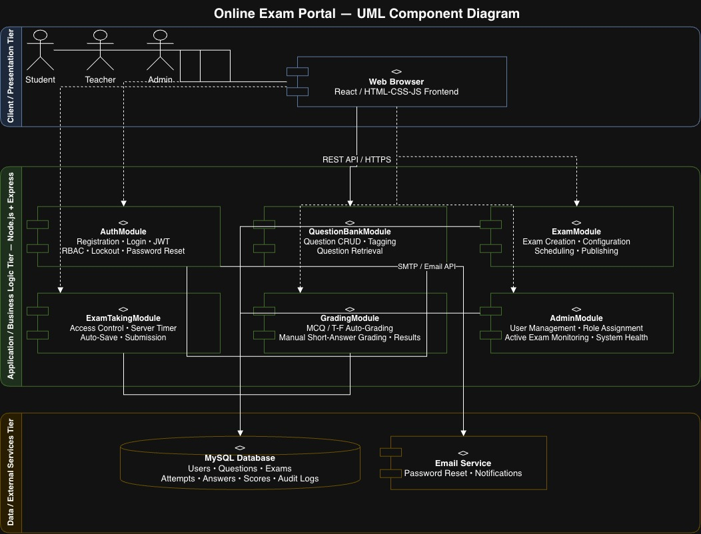

# Software Architecture and Design Specification (SAD)

**Project:** Online Exam Portal  
**Version:** 1.0  
**Authors:** [Person 2 Name]  
**Date:** 29-09-2026  
**Status:** Draft  

---

## Revision History

| Version | Date | Author | Change Summary |
|---|---|---|---|
| 1.0 | 29-09-2026 | [Person 2 Name] | Initial SAD draft |

---

## Approvals

| Role | Name | Signature / Date |
|---|---|---|
| Course Coordinator | | |
| Project Lead | | |

---

## Table of Contents

1. Introduction
2. Document Overview
3. Architecture
4. Design
5. Appendices

---

## 1. Introduction

### 1.1 Purpose

This document specifies the software architecture and design of the Online Exam Portal. It translates the functional and non-functional requirements defined in the SRS into a concrete architectural blueprint, including component structure, design decisions, API contracts, security architecture, and UX considerations. It serves as the primary reference for developers implementing the system.

### 1.2 Scope

This document covers the full architecture of the Online Exam Portal, including:
- The three-tier layered architecture (Presentation, Application, Data)
- All six backend modules: AuthModule, QuestionBankModule, ExamModule, ExamTakingModule, GradingModule, AdminModule
- REST API design for the authentication and exam-taking flows
- Sequence diagrams for two primary system flows
- Security architecture including threat modeling
- UX design principles for the student and teacher interfaces

It does not cover deployment infrastructure, CI/CD pipelines, or mobile application design.

### 1.3 Audience

- **Developers:** Primary audience — use this to implement components and APIs
- **QA Engineers:** Use the API contracts and sequence diagrams to design integration test cases
- **Security Auditors:** Use the threat model and security architecture sections
- **Instructors / Evaluators:** For assessing architectural correctness and completeness

### 1.4 Definitions

| Term | Definition |
|---|---|
| SAD | Software Architecture and Design — this document |
| SRS | Software Requirements Specification — the requirements document this SAD is based on |
| ADR | Architecture Decision Record — a documented rationale for a key design choice |
| STRIDE | A threat modeling framework: Spoofing, Tampering, Repudiation, Information Disclosure, Denial of Service, Elevation of Privilege |
| REST | Representational State Transfer — architectural style for web APIs |
| JWT | JSON Web Token — used for stateless session authentication |
| RBAC | Role-Based Access Control |
| TLS | Transport Layer Security |
| OEP | Online Exam Portal |
| FR | Functional Requirement (from SRS) |

---

## 2. Document Overview

### 2.1 How to Use This Document

This document is organized into two major parts:

- **Section 3 — Architecture:** Covers the high-level structural decisions — how the system is divided into components, what technology is used, how requirements are traced to components, and how security threats are addressed.
- **Section 4 — Design:** Covers the detailed design — how components interact at runtime (sequence diagrams), what the API contracts look like, how errors are handled, and what the UI structure looks like.

Readers implementing a specific module should read Section 3.4 (Component Descriptions) for their module's responsibilities, then Section 3.8 (Traceability) to see which requirements they are responsible for, and then Section 4 for the detailed design of their interfaces.

### 2.2 Related Documents

| Document | Description |
|---|---|
| `SRS_OnlineExamPortal.md` | Software Requirements Specification — defines all FRs, NFRs, and SRs that this SAD is designed to satisfy |
| `SRS_OnlineExamPortal.md` (Section 8) | Requirements Traceability Matrix — maps requirement IDs to modules and test cases |
| `Test_Plan_Template for SE.docx` | Software Test Plan template — the STP document references this SAD's API contracts |

---

## 3. Architecture

### 3.1 Goals & Constraints

**Architectural Goals:**

| Goal | Description |
|---|---|
| Security | All user data and exam content must be protected at rest and in transit. Authentication and authorization must be enforced at every layer. |
| Reliability | The system must achieve 99.5% monthly uptime (OEP-NF-002) and handle exam submissions without data loss. |
| Performance | Response times must stay within 3 seconds at the 95th percentile under 100 concurrent users (OEP-NF-001). |
| Maintainability | The system must be modular so individual features (e.g., grading logic) can be updated without affecting unrelated modules. |
| Scalability | The architecture must support growth to 200+ users and 100 concurrent exam sessions (OEP-NF-003). |

**Architectural Constraints:**

- All client-server communication must use HTTPS / TLS 1.2+ (OEP-SR-001)
- Passwords must be stored as bcrypt hashes — plaintext storage is not permitted (OEP-SR-002)
- Role-based access control must be enforced server-side, not just in the UI (OEP-F-004)
- Exam timer must be synchronized with server time to prevent client-side manipulation (OEP-F-012)
- The system must be deployable on a standard Linux-based server environment

---

### 3.2 Stakeholders & Concerns

| Stakeholder | Primary Concerns |
|---|---|
| **Student** | Smooth exam experience, no data loss during submission, clear result display |
| **Teacher** | Easy exam creation and grading, reliable scheduling, accurate auto-grading |
| **Admin** | Full control over users and exams, system health visibility |
| **Developers** | Clear module boundaries, well-defined APIs, minimal coupling between components |
| **QA Engineers** | Testable components, predictable API responses, clear error codes |
| **Instructors / Evaluators** | Correctness of architecture, adherence to requirements, security coverage |

---

### 3.3 Component (UML) Diagram

> The component diagram below shows the major modules of the Online Exam Portal, their responsibilities, and their dependencies.



**Component diagram description (for reference):**

The system is structured as a three-tier architecture:

**Client / Presentation Tier:**
- **Web Browser** (`<<component>>`) — Renders the HTML/CSS/JavaScript (or React) UI for all three user roles: Student, Teacher, and Admin. Student, Teacher, and Admin are external users who interact with the system through the Web Browser; they are actors, not software components.

**Application / Business Logic Tier:**
- Six backend modules, each implemented as an Express.js router within the Node.js server, exposed over REST API / HTTPS:
  - **AuthModule** (`<<component>>`) — registration, login, JWT issuance, RBAC enforcement via Express middleware, account lockout, password reset
  - **QuestionBankModule** (`<<component>>`) — question CRUD operations, tagging, and search
  - **ExamModule** (`<<component>>`) — exam creation, configuration, scheduling, and publishing
  - **ExamTakingModule** (`<<component>>`) — exam access control, server-authoritative timer, auto-save, and submission
  - **GradingModule** (`<<component>>`) — auto-grading for MCQ/True-False, manual grading interface, result release
  - **AdminModule** (`<<component>>`) — user management, role assignment, active exam monitoring, system health dashboard

The Web Browser communicates with all six backend modules via **REST API / HTTPS**. There is no separate API Gateway component — HTTPS enforcement, JWT validation, RBAC checks, and input validation are all handled by Express middleware within the application tier.

**Data / External Services Tier:**
- **MySQL Database** (`<<database>>`) — persistent storage for all data; accessed by all six backend modules via parameterized SQL queries over the internal network only; never exposed directly to the client
- **Email Service** (`<<external service>>`) — sends transactional emails (password reset links, exam notifications); accessed exclusively by AuthModule via SMTP or third-party email API (e.g., Nodemailer / SendGrid)

---

### 3.4 Component Descriptions

> **Note on actors vs. components:** Student, Teacher, and Admin are external users (actors) who interact with the system through the Web Browser. They are not software components and do not appear in the component diagram as components.

| Component | Responsibility | Key Interfaces |
|---|---|---|
| **Web Browser (Client)** | Renders the UI for all three roles (Student, Teacher, Admin). Sends HTTP requests to the backend REST API. Stores the JWT session token in a secure **HttpOnly cookie** to prevent XSS-based token theft (OEP-SR-004). | REST API over HTTPS |
| **AuthModule** | Handles user registration, login, JWT generation and validation, RBAC middleware (applied to all protected routes), account lockout, and password reset. HTTPS enforcement, JWT validation, RBAC role checks, and input validation are applied as Express middleware — there is no separate API Gateway component. | `/api/auth/*` endpoints; Email Service |
| **QuestionBankModule** | Manages the full lifecycle of questions — creation, editing, deletion, tagging by subject/topic/difficulty, and retrieval for exam composition. | `/api/questions/*` endpoints; MySQL Database |
| **ExamModule** | Allows Teachers to create exams by selecting questions, configure settings (duration, window, shuffle), and publish them. Manages exam state transitions (draft → published → closed). | `/api/exams/*` endpoints; MySQL Database |
| **ExamTakingModule** | Controls Student access to exams (enforces time window), serves questions during an exam, handles auto-save every 60 seconds, and processes final submission. Timer is server-authoritative. | `/api/attempt/*` endpoints; MySQL Database |
| **GradingModule** | Automatically scores MCQ and True/False questions on submission. Provides a manual grading interface for Short Answer questions. Controls result publication. | `/api/grading/*` endpoints; MySQL Database |
| **AdminModule** | Provides Admin-only endpoints for user CRUD, role assignment, active exam monitoring, and system health indicators. | `/api/admin/*` endpoints; MySQL Database |
| **MySQL Database** | Persistent storage for all data: users, roles, questions, exams, attempts, answers, scores, audit logs. Accessed via parameterized queries only — never directly exposed to the client tier. | SQL over internal network |
| **Email Service** | Sends transactional emails: password reset links, exam schedule notifications, result release alerts. Accessed exclusively by AuthModule. | SMTP or third-party email API (e.g., Nodemailer / SendGrid) |

---

### 3.5 Chosen Architecture Pattern and Rationale

**Pattern chosen: Layered (Three-Tier) Architecture with modular backend**

**Rationale:**

| Alternative Considered | Reason Rejected |
|---|---|
| Microservices | Overly complex for a team project of this scale. Each module would require its own deployment, service discovery, and inter-service communication, introducing significant operational overhead with little benefit at this scale. |
| Monolithic single-file backend | No separation of concerns. Difficult to maintain, test, or extend. All team members would conflict editing the same files. |
| Serverless functions | Poorly suited for stateful exam sessions (timer synchronization, auto-save). Cold start latency would violate OEP-NF-001. |

**Layered architecture** was chosen because:
- It provides clear separation between UI, business logic, and data — each layer has a single responsibility
- Individual modules (AuthModule, ExamModule, etc.) can be developed and tested independently
- It is well-understood by the team and maps naturally to the six feature areas in the SRS
- It satisfies all performance and reliability requirements at the expected scale (100–200 users)

**ADR-001: Server-authoritative exam timer**
Decision: The exam countdown timer is maintained server-side. The client displays a timer but the server is the source of truth for when an exam expires.
Rationale: Client-side timers can be manipulated by students (e.g., changing system clock). Server-side enforcement is required by OEP-F-012 and OEP-F-013.

**ADR-002: JWT for session management**
Decision: Stateless JWT tokens are used for authentication instead of server-side sessions.
Rationale: JWTs allow the backend to validate identity without a database lookup on every request, improving performance. Token invalidation on logout is handled via a server-side denylist (OEP-SR-003).

---

### 3.6 Technology Stack & Data Stores

| Layer | Technology | Justification |
|---|---|---|
| **Frontend** | HTML5 / CSS3 / JavaScript (or React) | Standard web technologies, accessible from any browser without installation |
| **Backend** | Node.js with Express.js | Lightweight, widely used, good ecosystem for REST APIs and JWT handling |
| **Database** | MySQL | Relational model suits structured exam data (questions, attempts, scores); strong ACID guarantees protect submission integrity |
| **Authentication** | JWT (jsonwebtoken library) + bcrypt for password hashing | Industry standard; bcrypt with cost factor ≥ 10 satisfies OEP-SR-002 |
| **Email** | Nodemailer (SMTP) or SendGrid API | Handles password reset and notification emails (OEP-F-005) |
| **Communication** | HTTPS / TLS 1.2+ | Mandatory per OEP-SR-001 |
| **Version Control** | Git / GitHub | Source control and collaboration |

**Data Stores:**

| Store | Type | Contents |
|---|---|---|
| `users` table | Relational (MySQL) | User ID, name, email, hashed password, role, account status, lockout metadata |
| `questions` table | Relational (MySQL) | Question ID, type, text, options, correct answer, tags (subject, topic, difficulty), owner Teacher ID |
| `exams` table | Relational (MySQL) | Exam ID, title, duration, start/end datetime, shuffle flag, status, creator Teacher ID |
| `exam_questions` table | Relational (MySQL) | Junction table mapping exams to questions with assigned marks |
| `attempts` table | Relational (MySQL) | Attempt ID, student ID, exam ID, start time, submission time, status |
| `answers` table | Relational (MySQL) | Answer ID, attempt ID, question ID, student response, auto-score, manual-score |
| `audit_logs` table | Relational (MySQL) | Timestamp, user ID, action, IP address — for security audit trail |

---

### 3.7 Risks & Mitigations

| Risk | Likelihood | Impact | Mitigation |
|---|---|---|---|
| Student loses exam progress due to network drop | Medium | High | Auto-save every 60 seconds to server (OEP-F-014); answers recoverable on reconnect |
| Server downtime during an active exam | Low | High | Deploy with process manager (e.g., PM2); database backups; server-side timer preserves submission state |
| SQL injection or XSS attacks through exam inputs | Medium | High | Server-side input validation and parameterized queries on all database operations (OEP-SR-004) |
| JWT token stolen via XSS | Low | High | Store JWT in HttpOnly cookie (not localStorage); enforce HTTPS; short token expiry (30 min) |
| Concurrent exam submissions causing race conditions | Low | Medium | Use database transactions for submission writes to ensure atomicity |
| Exam timer drift between client and server | Medium | Medium | Client timer is display-only; server calculates expiry from stored start time on every request |

---

### 3.8 Traceability to Requirements

| Requirement ID | Requirement (Short) | Satisfied By |
|---|---|---|
| OEP-F-001 | Student registration | AuthModule — `/api/auth/register` |
| OEP-F-002 | Login & JWT issuance | AuthModule — `/api/auth/login` |
| OEP-F-003 | Account lockout after 5 failures | AuthModule — lockout logic in login handler |
| OEP-F-004 | RBAC enforcement | AuthModule — RBAC middleware applied to all routes |
| OEP-F-005 | Password reset via email | AuthModule + Email Service — `/api/auth/reset-password` |
| OEP-F-006 | Question creation (4 types) | QuestionBankModule — `/api/questions` POST |
| OEP-F-007 | Question tagging | QuestionBankModule — tags stored in `questions` table |
| OEP-F-008 | Question edit / delete | QuestionBankModule — `/api/questions/:id` PUT/DELETE |
| OEP-F-009 | Exam creation | ExamModule — `/api/exams` POST |
| OEP-F-010 | Exam settings configuration | ExamModule — exam config fields in `exams` table |
| OEP-F-011 | Exam publishing | ExamModule — `/api/exams/:id/publish` PATCH |
| OEP-F-012 | Countdown timer & auto-submit | ExamTakingModule — server-side timer via attempt start time |
| OEP-F-013 | Exam access window enforcement | ExamTakingModule — start/end datetime check on attempt creation |
| OEP-F-014 | Auto-save every 60 seconds | ExamTakingModule — `/api/attempt/:id/autosave` POST |
| OEP-F-015 | Prevent duplicate submission | ExamTakingModule — unique constraint on (student_id, exam_id) in `attempts` |
| OEP-F-016 | Auto-grading MCQ / True/False | GradingModule — scoring logic triggered on submission |
| OEP-F-017 | Manual grading interface | GradingModule — `/api/grading/:attemptId` PATCH |
| OEP-F-018 | Result release by Teacher | GradingModule — `/api/grading/:examId/release` PATCH |
| OEP-F-019 | Admin user management | AdminModule — `/api/admin/users` endpoints |
| OEP-F-020 | Admin active exam dashboard | AdminModule — `/api/admin/dashboard` GET |
| OEP-NF-001 | Response time ≤ 3s | Database indexing, efficient queries, connection pooling |
| OEP-NF-003 | 100 concurrent exam sessions | Stateless JWT auth + connection pool sized for concurrency |
| OEP-SR-001 | HTTPS / TLS 1.2+ | Express middleware (all modules) — enforces HTTPS, redirects HTTP |
| OEP-SR-002 | Password hashing (bcrypt) | AuthModule — bcrypt with cost factor 12 |
| OEP-SR-003 | JWT invalidation on logout | AuthModule — token denylist in database |
| OEP-SR-004 | Input validation / injection prevention | All modules — express-validator middleware + parameterized queries |
| OEP-SR-005 | CSRF protection | Express middleware (all modules) — CSRF token middleware on all POST/PUT/DELETE routes |

---

### 3.9 Security Architecture

**Threat Modeling using STRIDE:**

| Threat Category | Example Threat | Mitigation |
|---|---|---|
| **Spoofing** | A user impersonates another user or claims a different role | JWT includes user ID and role claim; signed with server secret. RBAC middleware validates role on every request. |
| **Tampering** | A student modifies their submitted answers after submission | Submissions are write-once; the `attempts` table uses a unique constraint. No edit endpoint exists after submission. |
| **Repudiation** | A user denies performing an action (e.g., submitting an exam) | All critical actions (login, submission, result release) are recorded in the `audit_logs` table with timestamp and user ID. |
| **Information Disclosure** | Exam questions leaked before the exam window opens | Questions are only served by ExamTakingModule after verifying the exam is active and the student has a valid attempt. |
| **Denial of Service** | An attacker floods the login endpoint to lock out all users | Rate limiting applied to `/api/auth/login` — maximum 10 requests per minute per IP address. |
| **Elevation of Privilege** | A Student calls a Teacher-only or Admin-only API endpoint | RBAC middleware enforces role checks server-side on every protected route. Returns HTTP 403 for unauthorized roles. |

---

## 4. Design

### 4.1 Design Overview

The Online Exam Portal follows a request-response design pattern. All client interactions are initiated by the browser via REST API calls over HTTPS. The backend processes each request through three layers:

1. **Middleware layer:** HTTPS enforcement → JWT validation → RBAC role check → Input validation
2. **Business logic layer:** The relevant module (Auth, Exam, Grading, etc.) processes the request
3. **Data layer:** The module reads from or writes to the MySQL database via parameterized queries

No business logic exists in the frontend — the client is purely a rendering layer. All enforcement (timer, access control, submission rules) happens server-side.

---

### 4.2 UML Sequence Diagrams

> Sequence diagrams are provided as images below. They were created in draw.io.

---

#### Sequence Diagram 1 — Student Login & Start Exam

**Flow description:**
1. Student submits login form (email + password)
2. AuthModule verifies credentials, checks lockout status, validates password hash
3. On success, AuthModule issues a JWT containing user ID and role
4. Student's browser stores JWT and loads the dashboard
5. Student clicks on an available exam
6. ExamTakingModule verifies the exam is within its active window
7. ExamTakingModule creates an attempt record with a server-side start timestamp
8. Questions are returned to the client; exam interface renders with timer


---

#### Sequence Diagram 2 — Exam Submission & Auto-Grading

**Flow description:**
1. Student clicks Submit (or timer reaches zero triggering auto-submit)
2. ExamTakingModule receives the submission request with all answers
3. ExamTakingModule checks that the attempt exists, belongs to the student, and has not already been submitted
4. Answers are saved to the `answers` table; attempt status is set to "submitted"
5. GradingModule is triggered and iterates over all MCQ and True/False answers
6. Each answer is compared to the correct answer in the `questions` table; score is calculated
7. Total score is written back to the `attempts` table
8. Student receives a confirmation message; results are visible after Teacher releases them


---

### 4.3 API Design

> Interface definitions for two core components: AuthModule and ExamTakingModule.

---

#### AuthModule API

**POST /api/auth/register**
- Description: Register a new Student account
- Request body:
```json
{
  "fullName": "string",
  "email": "string",
  "password": "string"
}
```
- Success response — HTTP 201:
```json
{
  "message": "Registration successful. Please log in."
}
```
- Error responses:
  - `400 Bad Request` — missing or invalid fields
  - `409 Conflict` — email already registered

---

**POST /api/auth/login**
- Description: Authenticate a user and issue a JWT
- Request body:
```json
{
  "email": "string",
  "password": "string"
}
```
- Success response — HTTP 200:
```json
{
  "token": "eyJhbGciOiJIUzI1NiIsInR5cCI6IkpXVCJ9...",
  "role": "Student",
  "fullName": "string"
}
```
- Error responses:
  - `401 Unauthorized` — invalid email or password
  - `403 Forbidden` — account locked due to too many failed attempts

---

**POST /api/auth/logout**
- Description: Invalidate the current JWT session
- Headers: `Authorization: Bearer <token>`
- Success response — HTTP 200:
```json
{
  "message": "Logged out successfully."
}
```

---

**POST /api/auth/forgot-password**
- Description: Send a password reset link to the user's email
- Request body:
```json
{
  "email": "string"
}
```
- Success response — HTTP 200:
```json
{
  "message": "If this email is registered, a reset link has been sent."
}
```
- Note: Response is intentionally generic to prevent user enumeration.

---

#### ExamTakingModule API

**POST /api/attempt/start**
- Description: Start an exam attempt for the authenticated Student
- Headers: `Authorization: Bearer <token>`
- Request body:
```json
{
  "examId": "integer"
}
```
- Success response — HTTP 201:
```json
{
  "attemptId": "integer",
  "questions": [
    {
      "questionId": "integer",
      "type": "MCQ | TrueFalse | ShortAnswer",
      "text": "string",
      "options": ["string"] 
    }
  ],
  "durationSeconds": "integer",
  "serverTime": "ISO8601 timestamp"
}
```
- Error responses:
  - `403 Forbidden` — exam not within active window
  - `409 Conflict` — student has already attempted this exam

---

**POST /api/attempt/:attemptId/autosave**
- Description: Save current answers without submitting
- Headers: `Authorization: Bearer <token>`
- Request body:
```json
{
  "answers": [
    { "questionId": "integer", "response": "string" }
  ]
}
```
- Success response — HTTP 200:
```json
{
  "message": "Answers saved.",
  "savedAt": "ISO8601 timestamp"
}
```

---

**POST /api/attempt/:attemptId/submit**
- Description: Final submission of all exam answers
- Headers: `Authorization: Bearer <token>`
- Request body:
```json
{
  "answers": [
    { "questionId": "integer", "response": "string" }
  ]
}
```
- Success response — HTTP 200:
```json
{
  "message": "Exam submitted successfully.",
  "submittedAt": "ISO8601 timestamp"
}
```
- Error responses:
  - `409 Conflict` — exam already submitted
  - `403 Forbidden` — exam time window has expired

---

### 4.4 Error Handling, Logging & Monitoring

**Error Handling Principles:**
- All API errors return a consistent JSON structure:
```json
{
  "error": {
    "code": "INVALID_CREDENTIALS",
    "message": "The email or password you entered is incorrect."
  }
}
```
- Error messages shown to users are always plain English — no stack traces, SQL errors, or internal file paths are ever exposed (OEP-NF-004)
- All unhandled exceptions are caught by a global error handler middleware that logs the full error server-side and returns a generic 500 response to the client

**Logging:**
- All critical actions are logged to the `audit_logs` table: login attempts (success and failure), exam submissions, result releases, admin user changes
- Logs include: timestamp, user ID, action type, IP address, HTTP status code
- Passwords, JWT tokens, and exam answers are never written to logs
- Log retention: minimum 1 year for academic purposes

**Monitoring:**
- Server health endpoint: `GET /api/health` — returns uptime, database connectivity status, and current active exam count
- Key metrics tracked: API response time (p95), failed login rate, submission failure rate, database query time
- Alerts triggered if: response time exceeds 3s, error rate exceeds 5%, or database connection fails

---

### 4.5 UX Design

**Design Principles:**
- All interfaces must be usable without any prior training — first-time Students should be able to take an exam without a tutorial
- The exam interface is distraction-free: only the question, answer options, navigation, and timer are visible during an exam
- Color contrast ratios meet WCAG 2.1 AA (minimum 4.5:1 for normal text, 3:1 for large text) — OEP-NF-005
- All interactive elements (buttons, inputs, navigation links) are keyboard-accessible and have descriptive ARIA labels for screen reader compatibility

**Key Screens:**

| Screen | Role | Key Elements |
|---|---|---|
| **Login Page** | All | Email field, password field, login button, "Forgot password" link. Clean, minimal layout. |
| **Student Dashboard** | Student | List of upcoming exams with date/time, list of completed exams with result status, notifications panel |
| **Exam Interface** | Student | Question text, answer options, question navigation sidebar, countdown timer (top-right, turns red at 5 minutes remaining), Submit button |
| **Teacher Dashboard** | Teacher | "Create Question" button, "Create Exam" button, list of exams with status (Draft/Published/Closed), grading queue with pending count |
| **Grading Interface** | Teacher | Student name, question text, student response, mark input field (with max mark shown), Save button, Next Student button |
| **Admin Dashboard** | Admin | User management table (search, filter by role, activate/deactivate), active exam monitor (exam name, student count), system health indicators |

**Feedback & Error States:**
- Form validation errors appear inline below the relevant field, not as page-level alerts
- Successful actions (save, submit, publish) show a brief green confirmation banner
- The exam timer turns orange at 10 minutes remaining and red at 5 minutes remaining
- If auto-save fails, a visible warning appears: "Auto-save failed — check your connection"

---

### 4.6 Open Issues & Next Steps

| Issue / Enhancement | Priority | Notes |
|---|---|---|
| Video proctoring integration | Low | Out of scope for v1.0 — could be added as a third-party integration in a future version |
| Negative marking for MCQ | Medium | The data model supports it (score field allows negative values) but the grading logic for v1.0 only applies zero for wrong answers. Configuration option to be added in v1.1. |
| Bulk question import (CSV/Excel) | Medium | Teachers currently create questions one at a time. A bulk import feature would significantly improve usability for large question banks. |
| Mobile responsive design | Medium | Current UI targets desktop browsers. Responsive layout for tablets and mobile devices is planned for v1.1. |
| Result PDF export | Low | OEP-F diagram includes "Download Result PDF" as an extension — not implemented in v1.0 backend but the endpoint is reserved. |

---

## 5. Appendices

### 5.1 Glossary

| Term | Definition |
|---|---|
| ADR | Architecture Decision Record — a documented rationale for a significant design choice |
| RBAC | Role-Based Access Control — permissions are tied to roles (Student, Teacher, Admin), not individual users |
| JWT | JSON Web Token — a compact, self-contained token used for stateless authentication |
| STRIDE | Threat modeling framework: Spoofing, Tampering, Repudiation, Information Disclosure, Denial of Service, Elevation of Privilege |
| TLS | Transport Layer Security — cryptographic protocol for securing data in transit |
| REST | Representational State Transfer — architectural style for designing networked APIs |
| OEP | Online Exam Portal — the system described in this document |
| bcrypt | A password hashing algorithm designed to be computationally expensive to resist brute-force attacks |
| ACID | Atomicity, Consistency, Isolation, Durability — properties of reliable database transactions |

### 5.2 References

| Reference | Description |
|---|---|
| IEEE 42010:2011 | Standard for Architecture Description of Software-Intensive Systems |
| OWASP Top 10 | Standard awareness document for web application security risks |
| NIST SP 800-160 | Systems Security Engineering guideline |
| `SRS_OnlineExamPortal.md` | Requirements document this SAD is based on |

### 5.3 Tools

| Tool | Purpose |
|---|---|
| draw.io | Component diagrams and sequence diagrams |
| Swagger / OpenAPI | API documentation (future) |
| PlantUML | Alternative UML diagramming tool |
| MySQL Workbench | Database schema design and visualization |
| Postman | API testing during development |
